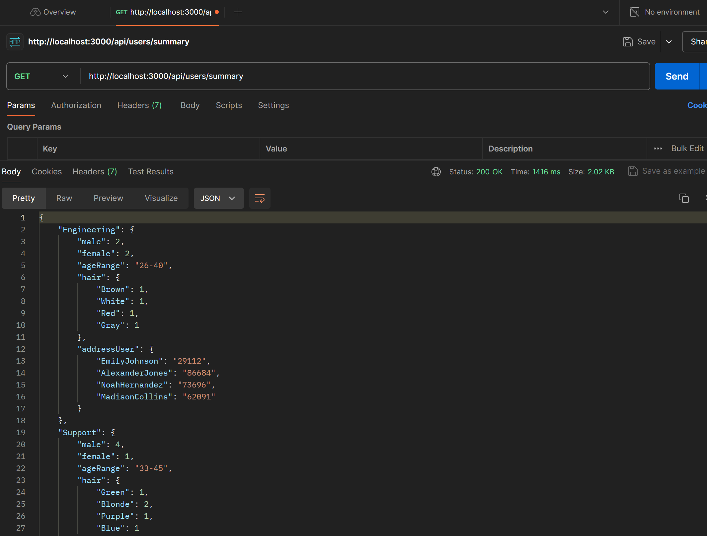

# Create Data from API
## Setup instructions
### Run the following command line to install express, axios, typescript, typescript config, jest and jest config.
1. ``` npm install express axios ```
2. ``` npm install --save-dev typescript @types/node @types/express jest ts-jest @types/jest ```
3. ``` npx tsc --init```
4. ``` npx ts-jest config:init ```

## How to run the server
1. Clone the project with ``` git clone https://github.com/Ethansven/tohome.git```
2. cd your repo
3. run ``` npm i ```
4. run ``` npm run dev ```
5. visit this [link](http://localhost:3000/api/users/summary)
## Sample requests using Postman


